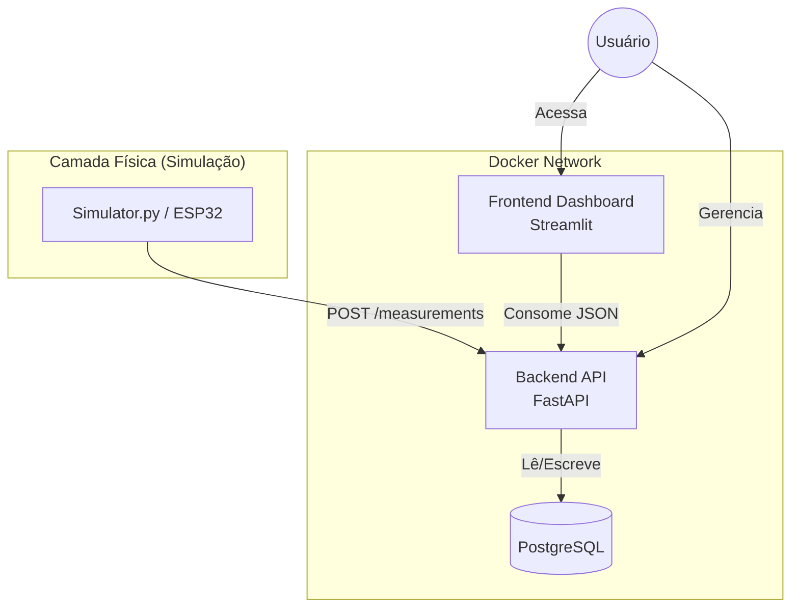
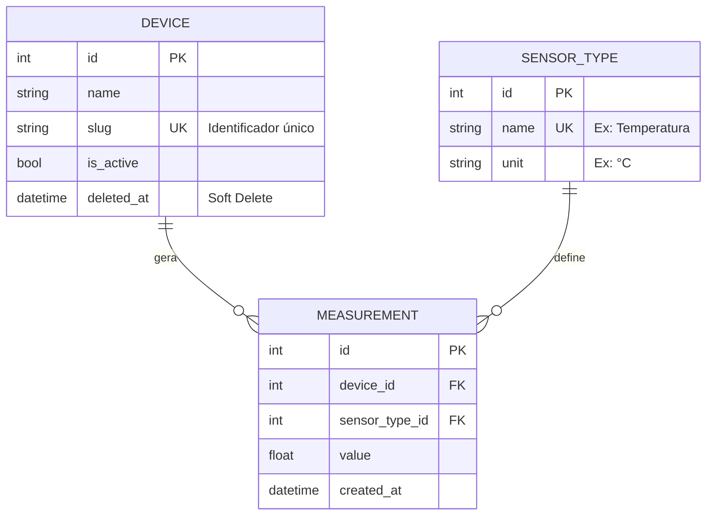

# 🔌 IoT Lab Core

> Uma arquitetura robusta e escalável baseada em microsserviços para orquestração de dispositivos IoT, coleta de dados telemétricos e visualização em tempo real.


## 📖 Sobre o Projeto

Este projeto nasceu da necessidade de criar um backend profissional para protótipos de robótica educacional (como sistemas de irrigação e estações meteorológicas) baseado em minha experiência com pesquisas acadêmicas que utilizavam IoT para captura de dados e automação. O diferencial desta solução, esta na aplicação de uma arquitetura baseada em API RESTful para gerenciar o ciclo de vida de dispositivos (CRUD) e ingerir grandes volumes de dados de sensores.

O sistema resolve o problema da **heterogeneidade de sensores** utilizando uma modelagem relacional flexível (Device ↔ Measurement ↔ SensorType).

---

## 🏗️ Arquitetura

O projeto roda inteiramente em containers Docker, orquestrados via Docker Compose.



### Tecnologias Chave

* **FastAPI:** Framework web de alta performance para construção da API.
* **SQLModel (SQLAlchemy + Pydantic):** ORM moderno para interação com banco e validação de dados.
* **PostgreSQL:** Banco de dados relacional robusto para persistência.
* **Streamlit:** Frontend em Python puro para gestão e visualização de dados.
* **Docker Compose:** Orquestração dos serviços (Banco, Backend, Dashboard).

---

## 🗂️ Estrutura do Banco de Dados

Foi utilizado uma abordagem simplificada do modelo **EAV (Entity-Attribute-Value)** para permitir flexibilidade nos tipos de sensores.



---

## 🚀 Como Rodar o Projeto

### Pré-requisitos

* Docker e Docker Compose instalados.
* Python 3.11+ (apenas para rodar o simulador localmente).

### 1. Clonar e Configurar

Clone o repositório e crie o arquivo de variáveis de ambiente:

```bash
git clone [https://github.com/Marcelo-Gallo/iot-lab-core.git](https://github.com/Marcelo-Gallo/iot-lab-core.git)
cd iot-lab-core

# Crie o arquivo .env na raiz com o seguinte conteúdo:

```

**Conteúdo do `.env`:**

```ini
POSTGRES_USER=user_iot
POSTGRES_PASSWORD=password_iot
POSTGRES_DB=db_iot_lab
DATABASE_URL=postgresql://user_iot:password_iot@db:5432/db_iot_lab

```

### 2. Subir a Infraestrutura

O comando abaixo irá construir as imagens, criar o banco, rodar as migrações automáticas e o *seed* inicial de dados.

```bash
docker-compose up --build

```

### 3. Acessar os Serviços

* **Dashboard (Frontend):** [http://localhost:8501](https://www.google.com/search?q=http://localhost:8501)
* **Documentação da API (Swagger):** [http://localhost:8000/docs](https://www.google.com/search?q=http://localhost:8000/docs)

---

## 🌡️ Simulando Dados

Para ver o sistema funcionando sem hardware real, utilize o script simulador incluído. Ele cria um ambiente virtual temporário e envia dados falsos para a API.

```bash
# 1. Crie e ative um ambiente virtual (Recomendado)
python3 -m venv .venv
source .venv/bin/activate  # Linux/Mac
# .venv\Scripts\activate   # Windows

# 2. Instale a dependência do simulador
pip install requests

# 3. Rode o simulador
python simulator.py

```

*O simulador buscará automaticamente o primeiro dispositivo ativo e começará a enviar leituras de Temperatura e Umidade.*

---

## 🛠️ Próximos Passos (Roadmap)

Este projeto é um MVP funcional. As seguintes melhorias estão planejadas:

* [ ] **Refatoração Async:** Migrar operações de banco de dados para `async/await` visando maior performance sob carga.
* [ ] **WebSockets:** Implementar comunicação em tempo real para atualizar o gráfico do Dashboard sem *polling* (atualização automática via HTTP).
* [ ] **Autenticação (Auth):** Adicionar login/token JWT para proteger os endpoints de escrita.
* [ ] **Testes Automatizados:** Implementar testes unitários e de integração com `pytest`.
* [ ] **Filtros de Data:** Adicionar seletores de intervalo de data no Dashboard para análise histórica.

---

## 🤝 Contribuição

Sinta-se à vontade para abrir Issues ou enviar Pull Requests. Este é um projeto educativo focado em boas práticas de Engenharia de Software aplicadas a IoT.

**Autor:** Gallo
